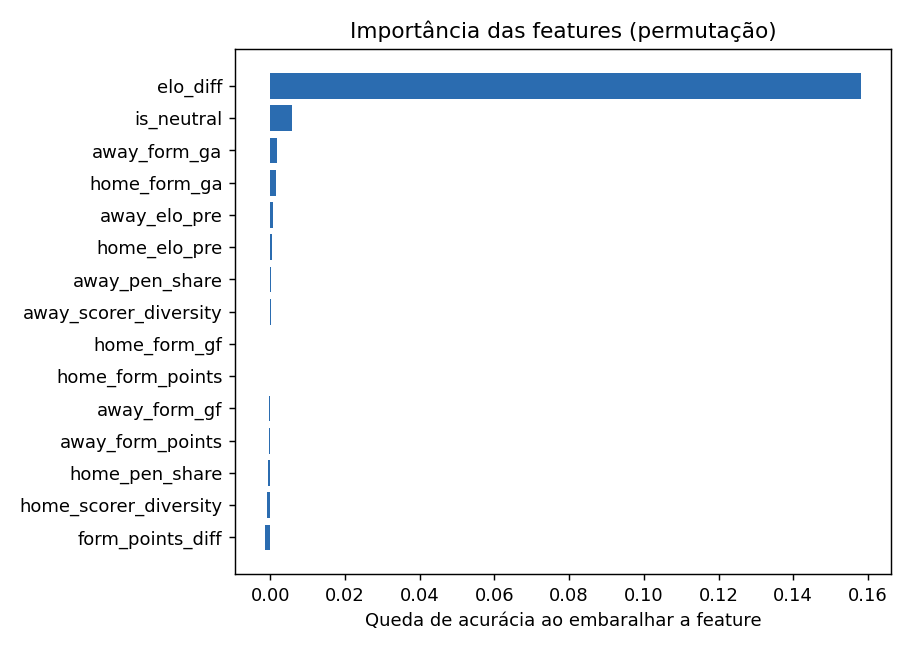
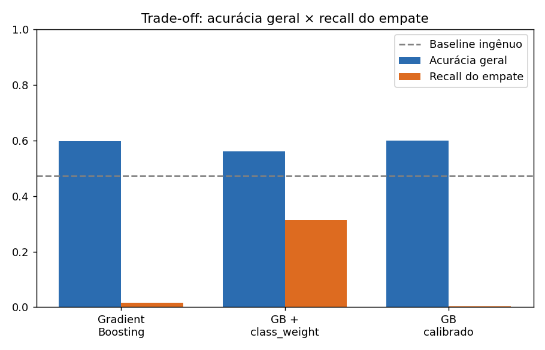

# ⚽ Prevendo Resultados de Futebol de Seleções com Machine Learning

> Pipeline completo de ciência de dados — da base bruta ao deploy de uma API —
> que estima a probabilidade de **Vitória / Empate / Derrota** em partidas
> internacionais de seleções, usando 152 anos de história do futebol.

**Projeto final de MBA em Ciência de Dados.** Tema escolhido por paixão: futebol.
Stack: Python · pandas · scikit-learn · FastAPI.

---

## 📌 Visão geral

Prever o resultado de um jogo de futebol é um problema clássico, difícil e cheio
de armadilhas estatísticas. Este projeto constrói um modelo honesto — que respeita
a ordem do tempo e evita "trapacear" olhando o futuro — e o entrega como um serviço
pronto para uso. O modelo final supera em **+12,7 pontos percentuais** um chute
ingênuo, e o trabalho vai além da acurácia: investiga *por que* empates são tão
difíceis de prever e se as probabilidades do modelo são confiáveis.

## 🎯 O problema de negócio

Estimar a probabilidade de cada desfecho de uma partida tem valor direto em
**análise de risco** (casas de aposta), **planejamento de comissões técnicas** e
**cobertura esportiva**. O objetivo não é "cravar o placar" — é produzir
probabilidades calibradas e defensáveis, usando apenas informação disponível
**antes da bola rolar**.

## 📊 Os dados

Base pública *International football results from 1872 to 2025* (Kaggle, `martj42`):

| | |
|---|---|
| Partidas | **49.353** jogos internacionais oficiais |
| Período | 1872 → 2025 (152 anos) |
| Cobertura | Copas do Mundo, eliminatórias, Copa América, Eurocopa, amistosos |
| Arquivos | `results.csv`, `goalscorers.csv` (artilheiros), `shootouts.csv`, `former_names.csv` |

A variável alvo (`result`) é o resultado do ponto de vista do mandante, e nasce
**naturalmente balanceada**: mandante vence 48,9%, visitante 28,4%, empate 22,7%.

## 🧠 Como funciona

O coração do projeto é a **engenharia de features sem vazamento de dados (data
leakage)**. Para cada partida, só usamos o que já se sabia antes dela acontecer:

- **Rating Elo** de cada seleção, recalculado jogo a jogo na ordem cronológica
  (a feature mais poderosa do modelo);
- **Forma recente**: média de pontos e gols nas últimas 5 partidas;
- **Features de ataque** (a partir dos artilheiros): dependência de pênaltis e
  diversidade de goleadores nas últimas 10 partidas;
- **Mando / campo neutro** — relevante porque em Copas muitos jogos não têm mando real.

A validação usa **split temporal** (treina no passado, testa no futuro), que simula
o uso real do modelo e evita o vazamento clássico de embaralhar jogos no tempo.

## 📈 Resultados

| Modelo | Acurácia | Recall do empate |
|---|---|---|
| Baseline ingênuo (sempre mandante) | 47,3% | — |
| Random Forest | 59,4% | 4% |
| **Gradient Boosting** | **60,0%** | 2% |
| Gradient Boosting + peso de classe | 56,0% | **32%** |

**O que o modelo aprendeu.** A diferença de Elo domina disparada — coerente com a
intuição futebolística de que força relativa decide a maioria dos jogos.



## ⚖️ IA responsável e limitações

O ponto mais interessante do projeto **não é o acerto, é o erro honesto**: o modelo
quase não prevê empates (2% de recall). Isso não é um bug — é estrutural. O empate
acontece justamente quando os times estão equilibrados, sem "assinatura estatística"
clara. Forçar o modelo a prever mais empates (peso de classe) eleva esse recall para
32%, mas derruba a acurácia geral. **Não existe almoço grátis** — e mostrar esse
trade-off explicitamente é mais valioso que esconder a fraqueza.



Outras limitações assumidas: o modelo ignora lesões, escalações e contexto de
torneio; e seleções com pouco histórico são previstas com mais incerteza. Por isso
o produto entrega **probabilidades calibradas**, não veredictos — é apoio à decisão,
não substituto do julgamento humano.

## 🏗️ Arquitetura e como rodar

```
mundial-ml/
├── data/raw/         # results.csv + goalscorers.csv
├── notebooks/        # 01 EDA · 02 modelagem · 03 IA responsável
├── src/
│   ├── data.py · features.py · modeling.py   # pipeline de dados e modelo
│   ├── responsible_ai.py                      # gráficos da Etapa 3
│   ├── team_state.py · predict.py · api.py    # deploy (Etapa 4)
├── reports/          # dicionário de dados + figuras
├── models/           # modelo treinado + estado das seleções
└── run_all.py        # roda o pipeline inteiro de uma vez
```

```bash
# setup (uma vez)
python -m venv .venv
.venv\Scripts\activate           # Windows  (Mac/Linux: source .venv/bin/activate)
pip install -r requirements.txt

# rodar o pipeline inteiro
python run_all.py

# subir a API
uvicorn src.api:app --reload     # docs interativa em http://127.0.0.1:8000/docs
```

A API separa o **treino** (pesado, offline) da **inferência** (leve, em tempo real):
um "retrato" do estado atual de 336 seleções é pré-calculado, e cada requisição só
monta as features e prevê. Exemplo de resposta para `Brazil` x `Argentina`:

```json
{ "probabilities": {"Brazil": 0.226, "draw": 0.187, "Argentina": 0.587},
  "most_likely": "Argentina" }
```

**Como testar a API no navegador:**
1. Rode `uvicorn src.api:app --reload` no terminal (aparece `Uvicorn running on http://127.0.0.1:8000`).
2. Abra no navegador: **http://127.0.0.1:8000/docs**
3. Clique em `POST /predict` → **Try it out**.
4. Preencha `home_team` e `away_team` (ex: `Brazil` e `Argentina`) e `neutral` (`true`/`false`).
5. Clique em **Execute** — a resposta com as probabilidades aparece logo abaixo.
6. Para parar o servidor, aperte `Ctrl + C` no terminal.

---

## 🎤 Roteiro de apresentação para a banca (~7 min)

**1. Abertura (30s).** "Escolhi futebol porque é minha paixão, mas o desafio técnico
é sério: prever resultados é um problema de classificação difícil e cheio de
armadilhas. Meu objetivo foi construir um modelo *honesto* e entregá-lo como produto."

**2. Os dados (1 min).** Mostre o volume (49 mil jogos, 152 anos) e a distribuição
do target já balanceada. Cite que a base inclui de Copas a amistosos.

**3. A grande sacada — data leakage (2 min).** Esse é o coração da nota. Explique:
"O erro mais comum seria calcular estatísticas com a base inteira ou embaralhar os
jogos no tempo. Eu calculo Elo e forma *cronologicamente* e faço split temporal —
treino no passado, testo no futuro." Use o conceito do PDF (variáveis do futuro,
mistura de dados) pra mostrar domínio.

**4. Resultados (1 min).** "60% de acurácia, +12,7 pontos sobre o baseline. A feature
mais importante é a diferença de Elo." Mostre o gráfico de importância.

**5. O momento que diferencia (1,5 min).** Mostre o trade-off do empate. "O modelo
erra empates, e eu sei *por quê*: empate não tem assinatura estatística. Posso forçar
o recall pra 32%, mas perco acurácia. Escolhi mostrar o trade-off em vez de esconder."
→ Isso demonstra maturidade e pensamento crítico, que é o que a banca procura.

**6. Produto (1 min).** Suba a API ao vivo (ou mostre o `/docs`). Faça uma previsão
na hora: Brasil x Argentina. "Separei treino de inferência — arquitetura real de
produção."

**7. Fechamento (30s).** "Entreguei as 4 etapas: base própria, pipeline sem leakage,
análise de IA responsável e deploy. As limitações são conhecidas e documentadas."

> **Dica:** se a banca perguntar "por que não usou XGBoost?", responda que o
> HistGradientBoosting do scikit-learn é gradient boosting equivalente, com a
> vantagem de zero dependências extras — uma decisão de engenharia consciente.

## 🔭 Próximos passos

Incorporar ranking FIFA oficial e escalações; testar redes neurais para sequências
temporais; e expandir a API para prever torneios inteiros via simulação de Monte Carlo.

---

*Desenvolvido como projeto final de MBA. Código e dados abertos.*